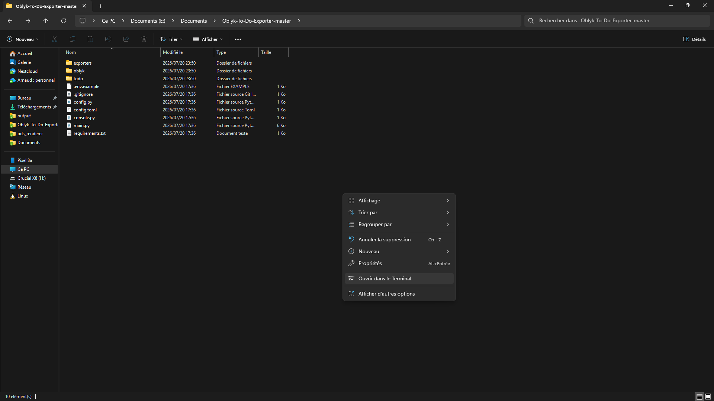
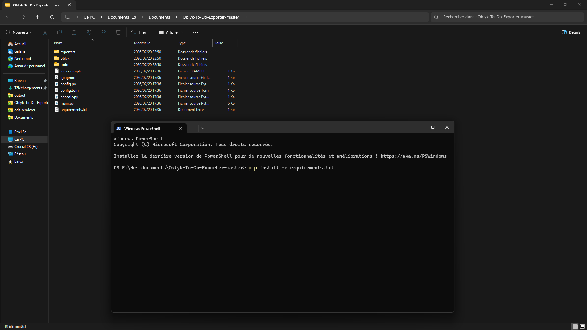
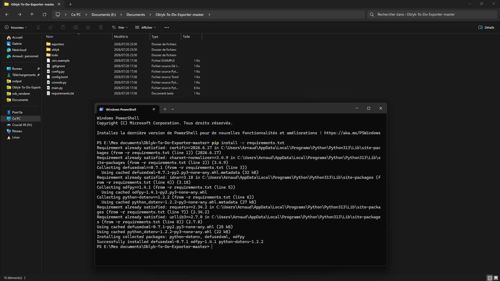
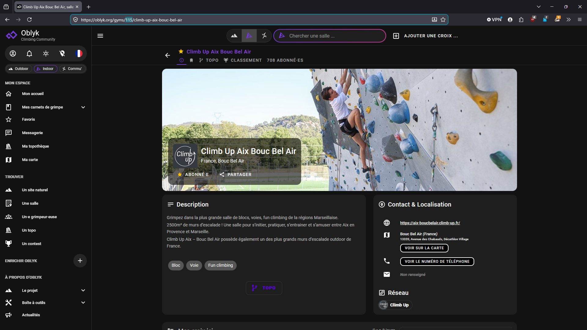
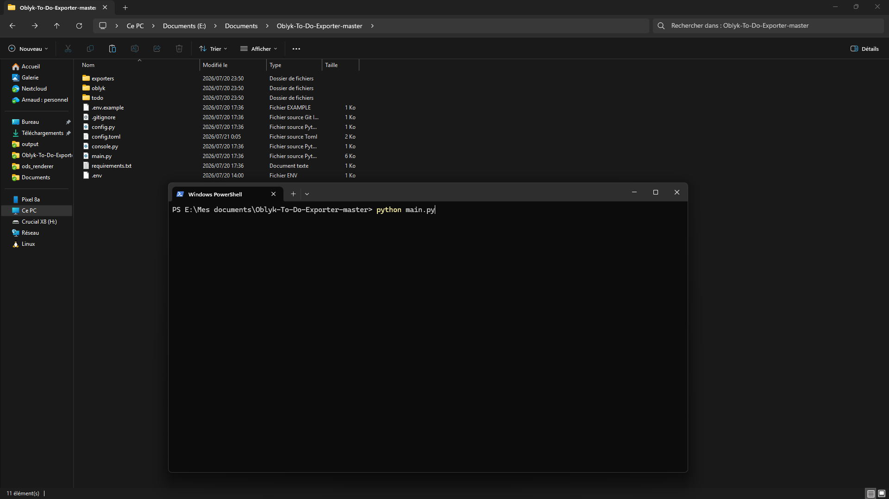
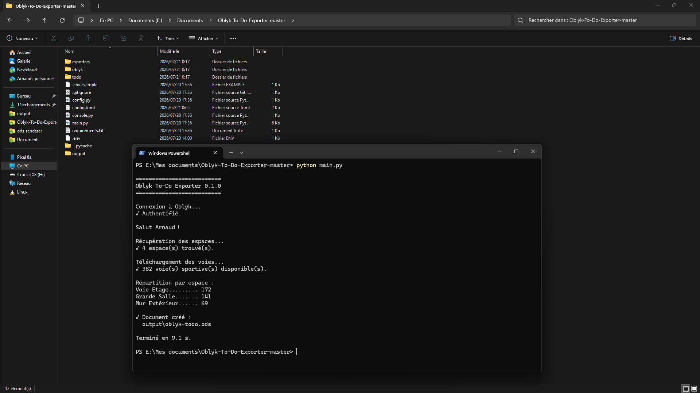
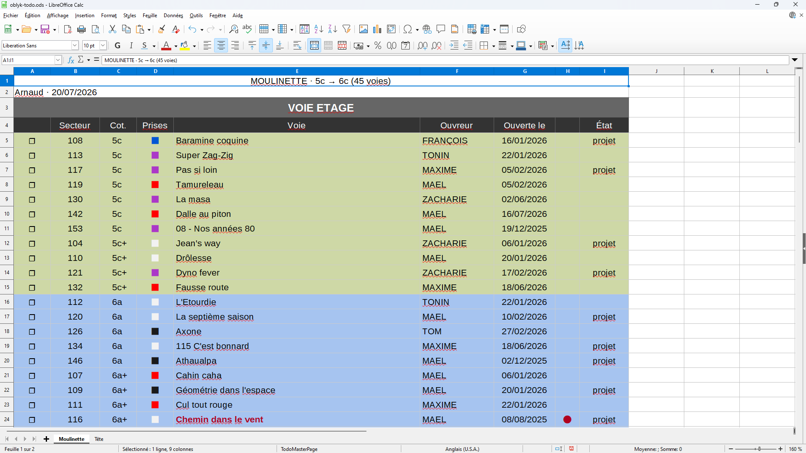
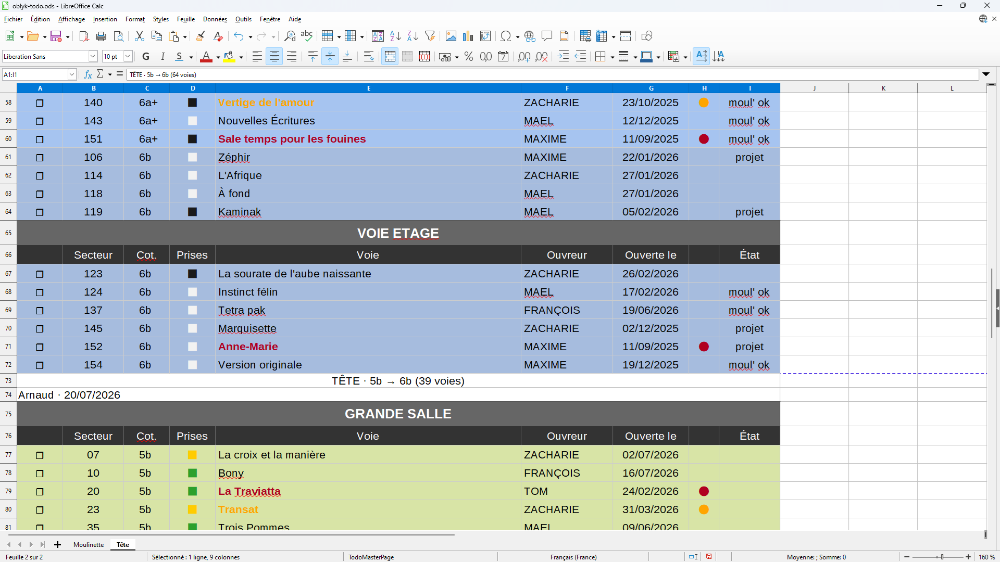

# Oblyk To-Do Exporter

This tool generates a printable *.ods (OpenDocument Spreadsheet) containing routes to work on in a Climb Up gym (other gyms using Oblyk may also be compatible, although this has not been tested), based on your climbing history and the routes currently available.

More specifically, the tool compares the routes currently available in your gym with those you have already climbed, either on top rope or lead, in order to generate two separate route lists:

- one for top rope climbing;
- one for lead climbing.

Both lists are generated according to your climbing history and the grade ranges you define independently for each sheet.

Routes are sorted by climbing area, sector, grade and hold colour (from easiest to hardest).

For each route, the document indicates whether it is a **project** (already attempted) or, for lead routes, whether it has already been completed on **top rope** ("Top rope OK").

Finally, by default, the oldest 15% of the routes in each sector are highlighted in red, while the next 15% are highlighted in orange, making it easy to identify routes that may soon be dismantled.

## Requirements

- An Oblyk account
- Python 3.11 or later
- The project's Python dependencies

## Installation

1. Download the project by clicking [here](https://github.com/arusabu/Oblyk-To-Do-Exporter/archive/refs/heads/master.zip).
2. Extract the ZIP archive wherever you like.
3. Open a terminal in the project's root directory (on Windows: right-click → **Open in Terminal**).



4. Run:

```bash
pip install -r requirements.txt
```



You should obtain something similar to:



## Configuration

### 1. Create the `.env` file

Copy `.env.example` and rename the copy to `.env`.

It must contain your Oblyk credentials:

```env
OBLYK_EMAIL=your_email
OBLYK_PASSWORD=your_password
```

Your credentials remain stored locally on your computer.

They are only used to authenticate with Oblyk and are never used for any other purpose.

### 2. Create or edit `config.toml`

Copy `config.toml.example` and rename the copy to `config.toml`.

It should contain:
- your gym ID;
- the grade ranges.

Example:

```toml
[gym]
id = 115

[top_rope]
grade_min = "5c"
grade_max = "6c"

[lead]
grade_min = "5b"
grade_max = "6b"
```

### Parameters

- `gym.id`: the Oblyk gym ID.

At the end of `config.toml`, a list of all Climb Up gyms supporting sport climbing is provided.

To find your gym ID, simply open your gym page on Oblyk and look at the URL.



Example:

`https://oblyk.org/gyms/115/climb-up-aix-bouc-bel-air`

The gym ID is **115**.

- `top_rope.grade_min` / `top_rope.grade_max`: grade range for the **Top Rope** sheet.
- `lead.grade_min` / `lead.grade_max`: grade range for the **Lead** sheet.

## Usage

Run:

```bash
python main.py
```



The program:

1. connects to Oblyk;
2. retrieves climbing areas and routes;
3. determines which routes should appear in each list;
4. generates an ODS document inside the `output/` folder.



## Output

The generated document contains two worksheets:

- **Top Rope**
- **Lead**

Each worksheet contains the routes to work on according to the configured grade ranges.





## Troubleshooting

### Unable to activate the virtual environment

If PowerShell reports that running scripts is disabled, run:
```bash
Set-ExecutionPolicy -Scope CurrentUser -ExecutionPolicy RemoteSigned
```
Confirm by pressing Y, then activate the virtual environment again:
```bash
.venv\Scripts\Activate.ps1
```
This change only affects your current Windows user account.

### Unable to connect

Check that:

- `.env` exists;
- your email address is correct;
- your password is correct;
- your Internet connection is working;
- your `.env` file is correctly filled in.

### No ODS file is generated

Check that:

- `config.toml` exists;
- `gym.id` is correct;
- your selected grade ranges actually exist in your gym ;
- your `config.toml` file is correctly filled in.

### Some expected routes are missing

Check that:

* the correct gym is specified (correct `gym.id` in `config.toml`);
* the grades entered in `config.toml` are the correct ones and do indeed exist in the hall.

### Need help?

If you encounter a bug, have a suggestion or need help using the program, feel free to open a GitHub Issue.

Suggestions are always welcome!

If you'd like to contribute directly to the project, Pull Requests are also welcome.